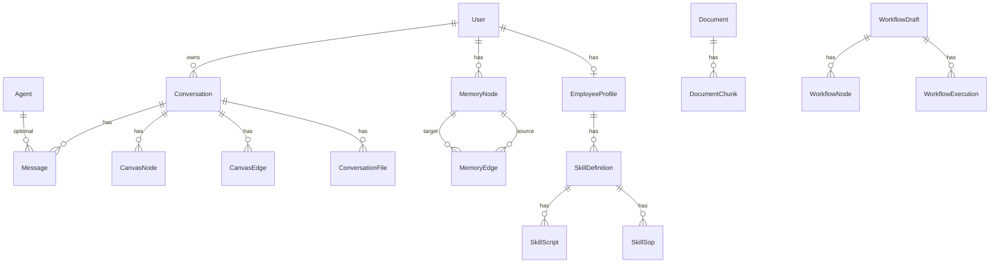

# PharmaAlpha 系统设计文档

## 一、项目定位

PharmaAlpha 是一个 **AI 驱动的医药投资分析平台**，核心能力是通过 LLM Agent 自动获取行情、财报、研报等金融数据，结合 RAG 知识库和跨会话记忆系统，为用户生成结构化的投资分析报告并在可视化画布上展示。

---

## 二、技术栈

| 层 | 技术 | 版本 |
|---|---|---|
| 前端框架 | Next.js (App Router) + React | 16.2.2 / 19.2.4 |
| 样式 | Tailwind CSS v4 + shadcn 4.x | CSS-first 配置 |
| 组件库 | Base UI + CVA + Lucide Icons | — |
| 画布 | @xyflow/react (React Flow v12) | — |
| 状态管理 | Zustand (canvas-store) + React Hooks | — |
| Agent 运行时 | Python 3.10+ (子进程 JSON Lines 协议) | — |
| LLM | OpenAI 兼容 API (DeepSeek/DashScope) | — |
| 数据库 | PostgreSQL + pgvector | pg16 |
| ORM | Prisma | — |
| 向量嵌入 | DashScope text-embedding-v4 | 1024 维 |
| 认证 | JWT (HS256) + HttpOnly Cookie | jose |
| 容器 | Docker Compose (pgvector/pgvector:pg16) | — |

---

## 三、系统架构

```
┌─────────────────────────────────────────────────────────────────────┐
│                          Browser (React)                            │
│  ┌──────────┐  ┌──────────────────┐  ┌───────────────────────────┐ │
│  │ ChatView │  │  InfiniteCanvas  │  │  InvestmentTeam Workbench │ │
│  │ 聊天面板  │  │  分析画布(xyflow) │  │  投资工作流(自建DAG)      │ │
│  └────┬─────┘  └────────┬─────────┘  └───────────┬───────────────┘ │
│       │ SSE             │ REST                    │ REST            │
├───────┼─────────────────┼─────────────────────────┼─────────────────┤
│       │          Next.js App Router (Node.js)      │                │
│  ┌────▼──────────────────────────────────────┐     │                │
│  │           /api/chat  (SSE)                │     │                │
│  │  auth → history → summarize → agent exec  │     │                │
│  │  → canvas tools → memory extract → flush  │     │                │
│  └────┬──────────────────────────────────────┘     │                │
│       │ stdin/stdout JSON Lines                     │                │
│  ┌────▼──────────────────────────────────┐  ┌──────▼──────────┐    │
│  │    PEC Agent (Python subprocess)      │  │ Employee Agent  │    │
│  │  Plan → Execute → Check → Synthesize  │  │  (LangGraph)    │    │
│  │  Tools: stock/fin/web/pdf/rag/memory  │  └─────────────────┘    │
│  └────┬──────────────────────────────────┘                          │
│       │ psycopg / HTTP                                              │
│  ┌────▼──────────────────────────────────────────────────┐         │
│  │        PostgreSQL + pgvector                           │         │
│  │  User | Conversation | Message | CanvasNode            │         │
│  │  MemoryNode | ConversationSummary                      │         │
│  │  Document | DocumentChunk (vector 1024)                │         │
│  └────────────────────────────────────────────────────────┘         │
└─────────────────────────────────────────────────────────────────────┘
```

---

## 四、前端架构

### 4.1 路由结构

| 路径 | 类型 | 功能 |
|------|------|------|
| `/` | 公开 | 营销落地页，macOS 风格界面 |
| `/login`, `/register` | 公开 | 认证页面 |
| `/chat` | 受保护 | 主聊天页（新对话） |
| `/chat/[conversationId]` | 受保护 | 历史对话 |
| `/agents` | 受保护 | Agent 管理列表 |
| `/settings` | 受保护 | 用户设置 |
| `/investment-team` | 受保护 | 投资团队工作流 |

布局采用路由组组织：`(dashboard)` 提供左侧 `IconRail`（64px 导航栏）+ 顶栏 `StatusBar`；`(auth)` 提供独立的认证页面布局。

### 4.2 核心组件

#### 聊天系统

- **`ChatView`**：工作台主体。左侧聊天面板 + 右侧无限画布，可拖拽分割条调整比例。集成 Agent 选择器、历史列表、`WelcomeDashboard`（示例 prompt 卡片）
- **`useChatStream`** hook：核心状态管理。`POST /api/chat` → SSE 流解析 → `MessageBlock[]` 状态更新。处理 `phase_start/end`、`plan`、`check`、`tool_start/result`、`chunk`、`result`、`error` 等 12 种事件类型
- **`ChatMessage`**：消息渲染组件。助手消息支持 `blocks`（PhaseBlock / AgentBlock / SupervisorBlock），每个 block 可展示工具事件（`ToolEventBadge`，可展开显示参数和结果）
- **`MarkdownRenderer`**：基于 react-markdown + remark-gfm + rehype-highlight 的 Markdown 渲染器

#### 画布系统

- **`InfiniteCanvas`**：基于 React Flow 的无限画布，支持 4 种节点类型（chart/image/pdf/text），统一为 `CanvasCardNode` 自定义节点
- **`canvas-store`** (Zustand)：节点/边管理，debounce 800ms 自动同步到服务端，`beforeunload` 时 `flushSave`
- 与 Agent 联动：Agent 通过 `canvas.add_node` tool_call 操作画布 → 前端监听 `onToolCall` 自动刷新

### 4.3 设计语言

- **医疗隐喻**：`CompanyVitalsCard`（公司"体征卡"）、ECG 心电动画、`vitals-green/red/amber` 语义色
- **macOS 风格**：`MacWindow` 组件（三色交通灯、毛玻璃背景）、`#f6f5f4` 米白色基底
- **字体**：Geist Sans / Geist Mono（next/font）
- **配色**：OKLCH 色彩空间，品牌色 `--color-scrub`（青绿），全局 CSS 变量定义于 `globals.css`

---

## 五、后端 API 设计

### 5.1 认证系统

JWT (HS256) + HttpOnly Cookie (`pa-session`)，7 天过期，bcrypt 密码哈希（12 轮）。Middleware 拦截受保护路由，未登录重定向至 `/login`。

### 5.2 API 清单

| 端点 | 方法 | 功能 | 认证 |
|------|------|------|------|
| `/api/auth/login` | POST | 登录 | 无 |
| `/api/auth/register` | POST | 注册 | 无 |
| `/api/auth/session` | GET | 获取当前会话 | Cookie |
| `/api/auth/logout` | POST | 登出 | 无 |
| `/api/chat` | POST | 主对话（SSE 流式） | 必须 |
| `/api/chat/history` | GET | 会话列表/历史消息 | 必须 |
| `/api/agents` | GET | Agent 列表（含自动同步） | 必须 |
| `/api/agents/[agentId]` | GET/PATCH | Agent 详情/更新 | 必须 |
| `/api/canvas/[convId]` | GET/PUT/POST | 画布 CRUD（全量同步） | 必须 |
| `/api/canvas/[convId]/actions` | POST | Agent 画布操作 | Bearer Key 或 Cookie |
| `/api/rag/ingest` | POST | 文档入库（PDF/URL/文本） | 必须 |
| `/api/rag/documents` | GET | 文档列表（分页） | 必须 |
| `/api/rag/documents/[id]` | DELETE | 删除文档 | 必须 |
| `/api/rag/search` | POST | 知识库向量检索 | 必须 |
| `/api/stocks/quote` | GET | 实时行情 | 无 |
| `/api/stocks/kline` | GET | K 线数据 | 无 |
| `/api/files/upload` | POST | 文件上传 | 必须 |
| `/api/files/[fileId]` | GET | 文件下载 | 必须 |
| `/api/tasks` | GET/POST | 异步任务管理 | 必须 |
| `/api/employee-investment/*` | 多种 | 投资工作流 CRUD | 必须 |

### 5.3 聊天主链路

```
POST /api/chat { agentId, conversationId?, newMessage }
  │
  ├─ 1. getSession() 认证
  ├─ 2. loadHistoryFromDB() 加载会话历史
  ├─ 3. estimateMessagesTokens() → 超阈值自动 LLM 摘要压缩
  ├─ 4. 加载画布节点 → 传入 params.canvas_nodes
  ├─ 5. executeAgent(spawn Python) → SSE 流
  │     ├─ transform: 拦截 canvas.* tool_call → executeCanvasTool
  │     └─ passthrough: 其余事件直接转发前端
  ├─ 6. flush: 助手回复写入 Message 表
  └─ 7. 异步: extractMemoryWithLLM → MemoryNode 表
```

---

## 六、数据库设计

### 6.1 ER 关系



### 6.2 核心模型

| 模型 | 字段要点 | 索引 |
|------|---------|------|
| **User** | id, name, email(unique), password, image | — |
| **Conversation** | id, title, userId | userId |
| **Message** | id, role, content, conversationId, agentId? | conversationId, agentId |
| **Agent** | id, name, displayName, entryPoint, enabled, config(JSON) | name(unique) |
| **CanvasNode** | id, conversationId, type, label, positionX/Y, width, height, data(JSON) | conversationId |
| **MemoryNode** | userId, category, subject, predicate, object, confidence, embedding(vector 1024), accessCount, lastAccessAt | userId, category, [userId,subject] |
| **MemoryEdge** | sourceNodeId, targetNodeId, relation | sourceNodeId, targetNodeId |
| **ConversationSummary** | conversationId(unique), userId, summary, topics[], embedding(vector 1024) | userId |
| **Document** | userId, title, sourceType, sourceUrl, fileHash(unique), status, chunkCount | userId, status |
| **DocumentChunk** | documentId, content, metadata(JSON), chunkIndex, embedding(vector 1024) | documentId |

---

## 七、Python Agent 系统

### 7.1 进程通信协议

Node.js 通过 `child_process.spawn` 启动 Python 子进程，通过 stdin/stdout 管道以 JSON Lines 协议通信：

- **输入**：stdin 写入单行 JSON（`AgentRequest`：action, messages, session_id, params）
- **输出**：stdout 按行输出 JSON（`AgentOutput`：chunk, plan, check, tool_start, tool_result, phase_start, phase_end, result, error 等）
- **超时**：默认 600s，超时发送 SIGTERM

### 7.2 PEC Agent 循环

```
                    ┌─────────────────────┐
                    │    初始化            │
                    │  memory_recall()    │
                    │  rag_search()       │
                    │  init_canvas_dedup()│
                    └─────────┬───────────┘
                              │
              ┌───────────────▼───────────────┐
              │         PLAN (非流式 JSON)     │
              │  注入: 记忆 + RAG + 画布 + 历史 │
              │  输出: { steps[], reasoning }  │
              └───────────────┬───────────────┘
                              │
                    steps 为空? ──是──▶ 直接 SYNTHESIZE
                              │否
              ┌───────────────▼───────────────┐
              │       EXECUTE (流式+工具)       │
              │  按计划调用工具获取数据          │
              │  运行时预算守卫 (80% 截断)      │
              └───────────────┬───────────────┘
                              │
              ┌───────────────▼───────────────┐
              │       CHECK (非流式 JSON)       │
              │  { passed, summary, gaps }     │
              └───────────────┬───────────────┘
                              │
                    passed? ──否──▶ 下一轮 (最多3轮)
                              │是
              ┌───────────────▼───────────────┐
              │     SYNTHESIZE (流式+画布工具)   │
              │  注入: 记忆 + 画布 + 执行数据    │
              │  输出: 最终回复 + AgentResult    │
              └─────────────────────────────────┘
```

各阶段 LLM 调用方式：

| 阶段 | 模式 | 工具 |
|------|------|------|
| Plan | 非流式 + `response_format: json_object` | 无 |
| Execute | 流式 + function calling | `_exec_registry`（全量工具） |
| Check | 非流式 + `response_format: json_object` | 无 |
| Synthesize | 流式 + function calling | `_synth_registry`（画布工具） |

### 7.3 工具系统

基于 `@tool` 装饰器 + `ToolRegistry` 的自动化工具注册：装饰器标记描述 → `function_to_schema` 通过 `inspect.signature` + `get_type_hints` 自动生成 OpenAI tools schema → 注册到 registry → LLM function calling 调用。

| 类别 | 工具 | 数据源 |
|------|------|--------|
| 行情 | `get_stock_quote`, `get_stock_kline` | Platform API → 新浪/东方财富 |
| 财务 | `fetch_financial_report` | 东方财富 F10 API |
| 财报 | `search_financial_reports` | 上交所 / 深交所 |
| 研报 | `search_research_reports` | 东方财富研报 |
| 下载 | `download_report_to_rag` | URL → PDF → RAG 入库 |
| 知识库 | `rag_search`, `rag_ingest` | pgvector 向量检索 |
| 记忆 | `memory_recall` | pgvector + 混合排序 |
| 网络 | `search_web`, `fetch_webpage` | Bing / 直接抓取 |
| 文档 | `read_uploaded_pdf` | pdfplumber |
| 画布 | `canvas_add_chart`, `canvas_add_text`, `canvas_add_image`, `canvas_remove_node`, `canvas_update_node` | Protocol event → 前端 |

### 7.4 Prompt 设计原则

四阶段 prompt 遵循**任务边界约束**原则：

- **Plan**：强制先查记忆/RAG，严格按用户请求范围规划，不自行扩展
- **Execute**：严格按计划执行，记忆/RAG 充分时跳过外部获取
- **Check**：只审查用户明确要求的内容，不因"可以更好"而不通过
- **Synthesize**：用户问什么答什么，不添加用户没要求的模块

---

## 八、记忆系统

### 8.1 三层模型

| 层 | 机制 | 模型 | 生命周期 |
|---|---|---|---|
| **工作记忆** | 会话历史 + 自动摘要 | Message + ConversationSummary | 会话内 |
| **长期记忆** | LLM 结构化提取 SPO 三元组 | MemoryNode (vector 1024) | 跨会话 |
| **知识记忆** | RAG 管线 (PDF/Web → 分块 → 嵌入) | Document + DocumentChunk | 永久 |

### 8.2 写入管线（异步，不阻塞响应流）

```
助手回复完成 → flush() 触发 extractMemoryWithLLM()
  → LLM 结构化提取 JSON [{category, subject, predicate, object, confidence}]
  → embedTexts() 生成向量
  → INSERT INTO MemoryNode
  → 超 200 条上限 → 按 lastAccessAt + accessCount 升序淘汰
```

提取类型：`entity`（实体事实）、`conclusion`（分析结论）、`preference`（用户偏好）、`event`（事件）。

### 8.3 检索管线（Agent 启动时同步执行）

```
query → embed(query) 生成查询向量
  → pgvector 余弦相似度检索 MemoryNode (top_k * 2 候选)
  → 混合重排:
      final_score = similarity * 0.6     // 语义相关性
                  + freq_score  * 0.2     // 访问频次 min(count/20, 1)
                  + decay       * 0.2     // 时间衰减 (半衰期30天指数衰减)
  → 追加 ConversationSummary 向量检索 (top 2, similarity > 0.5)
  → 合并排序 → top_k → 更新 accessCount/lastAccessAt
  → 降级策略: embedding 失败 → ILIKE 文本回退搜索
```

### 8.4 按阶段差异化注入

| PEC 阶段 | 记忆 | RAG 预查 | 画布状态 | 设计理由 |
|----------|------|---------|---------|---------|
| **Plan** | 注入 | 注入 | 注入 | 决策阶段，需要全局视野避免重复获取 |
| **Execute** | 不注入 | 不注入 | 注入 | 轻量执行器，最大化工具调用 token 空间 |
| **Check** | 不注入 | 不注入 | 不注入 | 仅比对执行结果 vs 用户请求 |
| **Synthesize** | 注入 | 不注入 | 注入 | 需要用户偏好/历史来个性化输出 |

Execute 不注入记忆的合理性：记忆的决策价值已通过 Plan → steps 描述间接传递；Execute 是无状态执行器，不做额外决策；PEC 循环本身解决了"数据不足"的问题（Check 失败 → 重新 Plan）。Synthesize 不注入 RAG 预查是因为它已经拿到了 Execute 阶段的全部工具结果（包括 `rag_search` 的返回）。

---

## 九、上下文管理

### 9.1 ContextBuilder

统一的 LLM 上下文组装器，声明式构建消息列表并强制 token 预算：

**组装顺序**：

```
system_prompt → memory/rag 注入 → environment(时间/画布) → chat_history → phase_inject
```

**消息标签体系**（内部 `_tag` 字段，build 后自动移除）：

| 标签 | 截断策略 |
|------|---------|
| `system_prompt` | 永不截断 |
| `env_context` | 永不截断（记忆/RAG/画布/时间） |
| `phase_inject` | 永不截断（步骤描述/审查结果） |
| `chat_history` | 可截断（保留最近 2 轮 user 消息） |
| `tool_result` | 单条上限 2000 字符 |

**预算执行**：默认 40000 token，启发式字符级估算（ASCII ×0.3 + Non-ASCII ×1.5）。超预算时从可删除消息中按时间顺序删除，直到预算内。

### 9.2 运行时二次守卫

Execute 阶段的 `_run_tool_loop` 中，工具结果不断累积。当 `llm_messages` 超过 80% 预算时，对除最后一条外的 `role=tool` 消息做头 500 + 尾 500 字符截断，防止上下文溢出。

### 9.3 自动摘要

当会话历史的 token 估算超过预算的 50% 时，自动触发 LLM 摘要压缩：

- 保留最近 4 条消息
- 对旧消息生成 500 字以内的中文摘要
- 摘要作为 `[对话历史摘要]` system 消息替换旧历史
- 摘要 + embedding 写入 `ConversationSummary` 供跨会话检索

---

## 十、RAG 管线

### 10.1 文档入库

```
输入 (PDF/URL/文本)
  → parse (pdfplumber / BeautifulSoup / 纯文本)
  → fileHash 去重（已存在则跳过）
  → recursive_chunk (512 token, 64 overlap)
      按段落 → 句子 → 字符三级递归分割
  → batch embed (DashScope text-embedding-v4, 每批 10 条)
  → INSERT DocumentChunk with vector(1024)
  → 更新 Document status: ready
```

### 10.2 检索

```
query → embed(query)
  → pgvector 余弦相似度搜索 DocumentChunk
  → JOIN Document (status='ready', 可选 sourceType 过滤)
  → 返回 top_k 片段 + score + metadata
```

### 10.3 Agent 集成

- **`rag_search`** 工具：Agent 在 Execute 阶段主动检索知识库
- **`rag_ingest`** 工具：Agent 可触发文档入库
- **`download_report_to_rag`** 工具：下载 PDF 并自动入库
- **RAG 预查**：Agent 启动时自动 `_pre_search_rag(user_question)` 并注入 Plan 上下文

---

## 十一、Embedding 服务

Python (`embedding.py`) 和 TypeScript (`embedding.ts`) 双端统一抽象，支持多 provider 切换：

| Provider | 模型 | 维度 | 备注 |
|----------|------|------|------|
| DashScope (默认) | text-embedding-v4 | 1024 | 当前生产配置 |
| OpenAI | text-embedding-3-small | 1536 | 可切换 |
| Zhipu | embedding-3 | 1024 | 备选 |
| Local BGE | bge-small-zh-v1.5 | 512 | 仅 Python 端，离线场景 |

配置通过环境变量：`EMBEDDING_PROVIDER`、`EMBEDDING_API_KEY`、`EMBEDDING_MODEL`、`EMBEDDING_DIMENSIONS`。批次限制 10（DashScope API 约束），超时 30s，失败降级不崩溃。

---

## 十二、画布去重机制

每次对话请求时，后端从 DB 加载当前会话的画布节点，通过 `params.canvas_nodes` 传递给 Python Agent。Agent 启动时进行两层防护：

1. **去重 Set**（`canvas_tools.py`）：`init_dedup_from_canvas(nodes)` 预填充 `_added_chart_tickers`（frozenset）和 `_added_text_labels`（set），`canvas_add_chart` / `canvas_add_text` 调用时检查重复
2. **Context 注入**（`ContextBuilder`）：`inject_environment(canvas_history=...)` 在 prompt 中告知 LLM "画布上已有的内容（不要重复添加）"

---

## 十三、部署配置

### Docker Compose

```yaml
services:
  db:
    image: pgvector/pgvector:pg16
    ports: ["5432:5432"]
    volumes: [pgdata:/var/lib/postgresql/data]
    environment:
      POSTGRES_USER: postgres
      POSTGRES_PASSWORD: postgres
      POSTGRES_DB: pharma_alpha
```

### 关键环境变量

| 变量 | 用途 |
|------|------|
| `DATABASE_URL` | PostgreSQL 连接字符串 |
| `LLM_API_KEY` | LLM API 密钥 |
| `LLM_BASE_URL` | LLM API 端点 |
| `LLM_MODEL` | LLM 模型名 |
| `EMBEDDING_PROVIDER` | 嵌入服务提供商 |
| `EMBEDDING_API_KEY` | 嵌入 API 密钥 |
| `EMBEDDING_MODEL` | 嵌入模型名 |
| `EMBEDDING_DIMENSIONS` | 向量维度 |
| `NEXTAUTH_SECRET` | JWT 签名密钥 |
| `AGENT_API_KEY` | Python ↔ Node.js 内部通信密钥 |

---

## 十四、安全设计

| 层 | 机制 |
|---|---|
| 认证 | JWT + HttpOnly Cookie，bcrypt 密码哈希（12 轮） |
| 路由保护 | Middleware 拦截受保护路由，未登录重定向 |
| Agent API | Bearer Token 用于 Python → Node.js 内部调用 |
| 数据隔离 | 画布/文档按 userId + conversationId 校验属主 |
| 输入限制 | content 截断 4000 字符（记忆提取）、工具结果 2000 字符、嵌入批次 10 |
| 数据源限制 | 财报/研报仅允许从上交所/深交所/东方财富获取，禁止通用网页抓取 |
